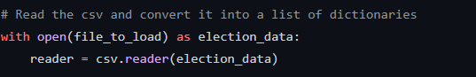
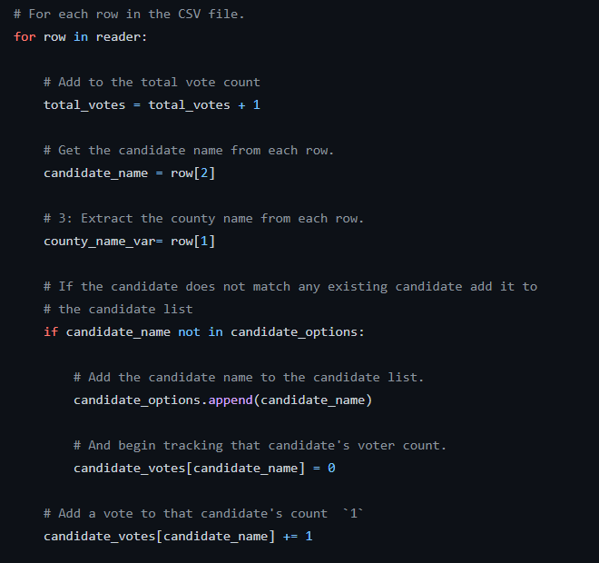
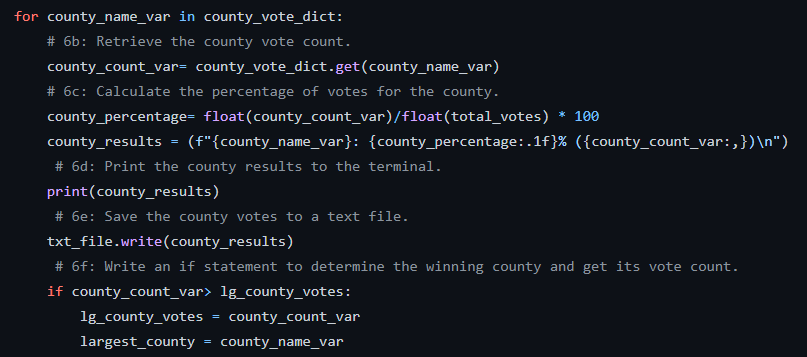

# Election_Analysis
In this project we completed an election audit on the results for the Colorado Board of Elections.
## Project Overview
The election commision has requested an audit of the recent election. They have asked us to find:  
 
  1.Total number of votes cast 
  2.A complete list of candidates who received votes 
  3.Total number of votes each candidate received 
  4.Percentage of votes each candidate won 
  5.The winner of the election based on popular vote 
 
They have also requested that we add analysis for each voting county including their percentage of votes and total votes. 
## Election Audit Results 
The results of our election analysis are shown below: 
-There were 369,711 total votes cast in this congressional election? 
 
The total votes and percentage of votes per count: 
-Jerfferon county had a total of 38,855 votes which accounted for 10.5% of the total votes. 
-Denver county had a total of 306,055 votes which accounted for 82.8% of the total votes. 
-Arapahoe county had a total of 24,801 votes which accounted for 6.7% of the total votes. 
 
The county with the largest number of votes: 
Denver county with 306,055 votes
 
The candidate resuls were: 
-Charles Casper Stockham received 23.0% of votes with 85,213 votes. 
-Diana DeGette received 73.8% of votes with 272,892 votes. 
-Raymon Anthony Doane received 3.1% of votes with 11,606 votes. 
 
The winning candidate was: 
-Diana Degette won the election with 73.8% of votes and a final vote count of 272,892 votes. 
 
## Election-Audit Summary
This script can be modified for future election with a few modification. This can be applied to different data sets by changing the csv file and we can . 
 
 
 
We can reuse the code used in this script and use the same programming flow to find other factors that can tell us more about the election. We can use the following codes to look at different cariables.  
 
 
 
 
 
Depending on information given in the dataset, we can anlayze different factors such as states, cities, or district. We can also use this script to grab the demographic of voters for each candidate. We can collect information on socio-economic status, race, or political views. We will need to modify the script variables and create new list and dictionaries but the formala can be repeated to find new string or numberic variables. We can find these new variables by reusing our code and it can tell us more information about the election.
